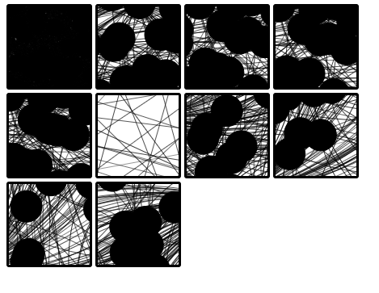

svg-centre
=========

Lets shrink our svg just to the elements being shown within it.

```
centre = require('svg-centre')


// shrink a single svg
centre.shrink(document.getElementById('svg1'))

// or

// shrink all svgs
centre.shrinkall()


//create a montage of equally sized normalised svgs
centre.shrinkall(square='30vw')


```

